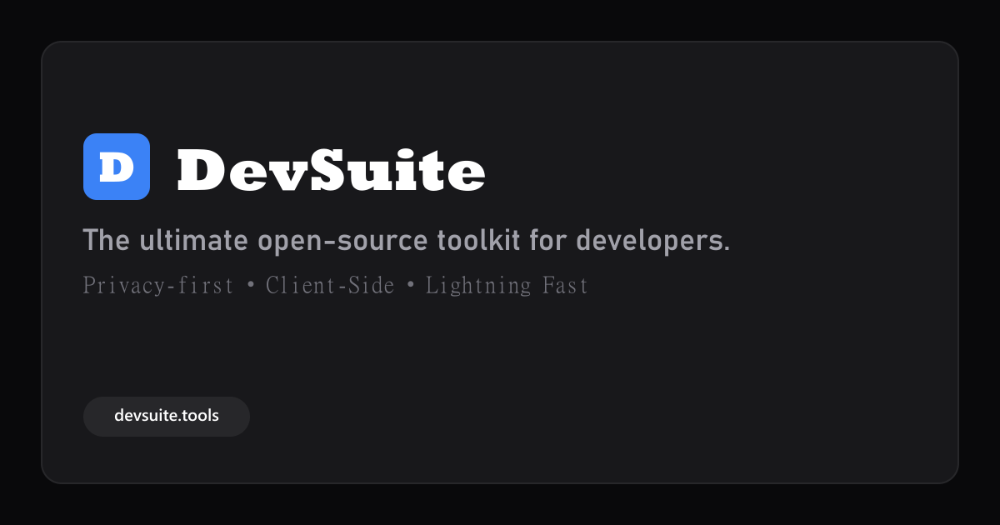

# DevSuite — The Ultimate Developer Toolkit



DevSuite is a lightning-fast, privacy-respecting collection of 16 essential developer tools built with **Astro 4** and **Tailwind CSS**. It is designed to be fully client-side, ensuring that your sensitive data (like JSON payloads, passwords, and JWTs) never leaves your browser.

## ✨ Features

- **100% Client-Side Processing:** Zero server-side tracking. Your data stays in your browser.
- **Lightning Fast:** Built on Astro's island architecture for zero JS overhead where possible.
- **Dark Mode Support:** Seamlessly switches between light and dark themes (press `D` to toggle).
- **SEO Optimized:** Contains 13,000+ words of rich, targeted encyclopedia content and FAQ schema out-of-the-box.
- **Monetization Ready:** Pre-configured sidebar layouts designed specifically for seamless Google AdSense integration.
- **Keyboard Navigation:** Press `?` to view shortcuts, `/` or `Ctrl+K` to search tools instantly.

## 🧰 Included Tools

1. **JSON Formatter & Validator** - Format, minify, and validate JSON payloads.
2. **JWT Decoder** - Decode JSON Web Tokens to view header and payload data.
3. **Base64 Encoder / Decoder** - Encode strings to Base64 or decode them back to text.
4. **Hash Generator** - Generate MD5, SHA-1, SHA-256, and SHA-512 hashes.
5. **Lorem Ipsum Generator** - Generate placeholder text by paragraphs, sentences, or words.
6. **UUID / GUID Generator** - Generate bulk version 4 UUIDs instantly.
7. **Strong Password Generator** - Create cryptographically secure passwords with custom rules.
8. **Markdown Previewer** - Write Markdown and preview the compiled HTML live.
9. **Regex Tester** - Test regular expressions against text with live highlighting.
10. **Word & Character Counter** - Count words, characters, sentences, and paragraphs.
11. **Text Case Converter** - Convert text to camelCase, snake_case, PascalCase, UPPERCASE, etc.
12. **Text Encrypt / Decrypt** - Encrypt text using AES (Advanced Encryption Standard).
13. **CSS Gradient Generator** - visually build linear and radial CSS background gradients.
14. **Color Converter** - Convert between HEX, RGB, HSL, and CMYK formats.
15. **Box Shadow Generator** - Design CSS box shadows with an interactive preview.
16. **PX to REM Converter** - Convert pixels to relative em units for responsive design.

## 🚀 Getting Started

### Prerequisites
- [Node.js](https://nodejs.org/) (v18 or higher)
- npm (or pnpm/yarn)

### Installation

1. Clone the repository:
   ```bash
   git clone https://github.com/Tech-no-mad/DEVSUITE.git
   cd DEVSUITE
   ```

2. Install dependencies:
   ```bash
   npm install
   ```

3. Start the development server:
   ```bash
   npm run dev
   ```

4. Open your browser and navigate to `http://localhost:4321`.

## ☁️ Deployment

DevSuite is optimized for static hosting platforms like **Cloudflare Pages**, **Vercel**, or **Netlify**.

To build for production:
```bash
npm run build
```
This will generate a `dist/` directory containing the fully optimized static site, which you can upload directly to your hosting provider.

## 📄 License

This project is open-source and available under the [MIT License](LICENSE).
